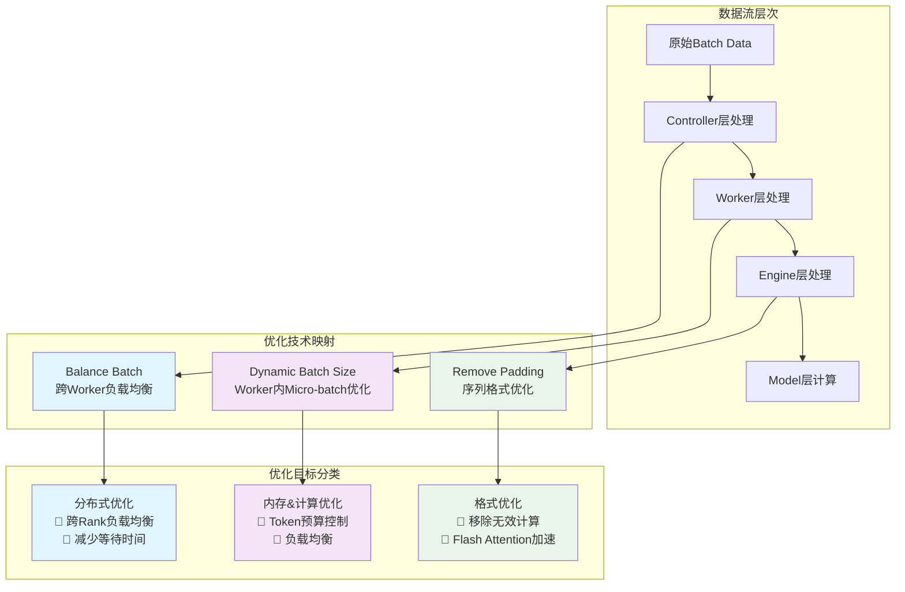
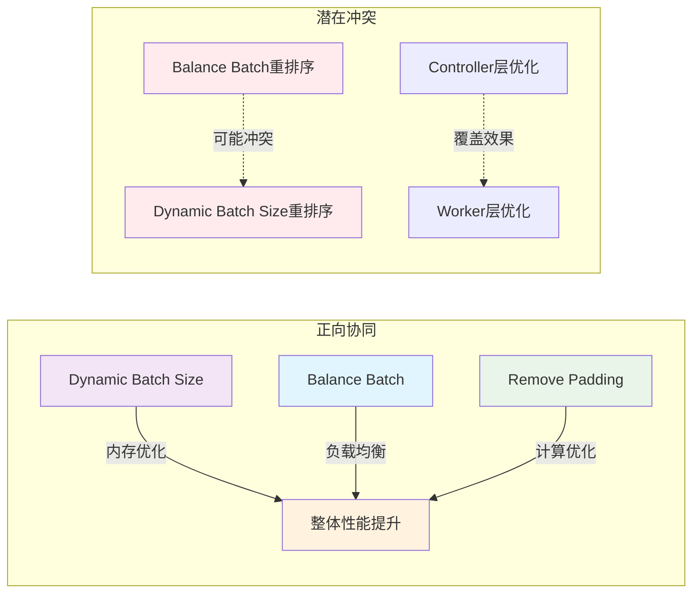
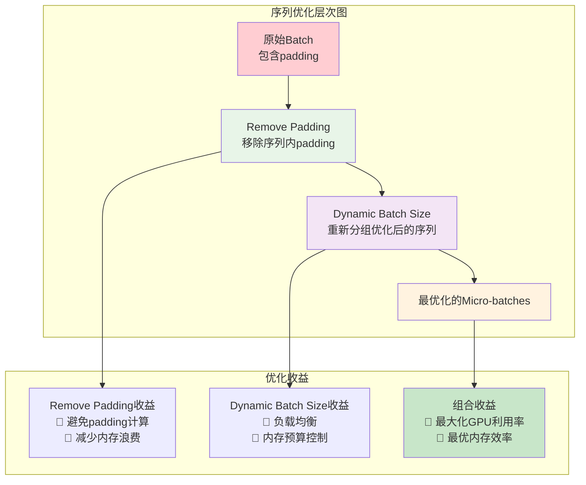
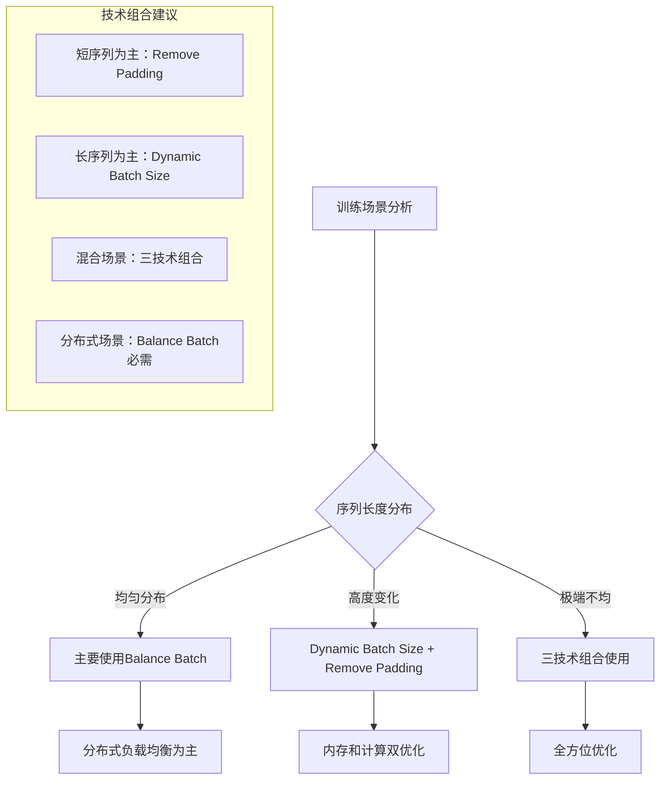
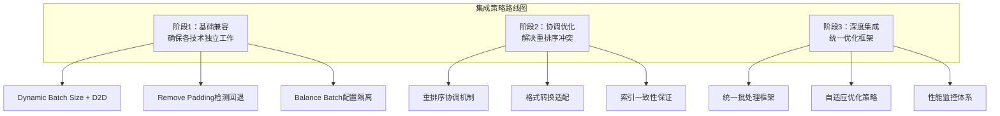

# 批处理优化技术对比分析：Dynamic Batch Size vs Balance Batch vs Remove Padding

## 概述

VERL框架中存在三种不同层面的批处理优化技术，它们有着不同的优化目标和作用范围：

1. **Dynamic Batch Size** - 单worker内的micro-batch优化
2. **Balance Batch** - 跨worker的负载均衡优化  
3. **Remove Padding** - 单序列内的格式优化

## 1. 优化技术详细对比

### 1.1 Dynamic Batch Size

**优化目标**：
- 🎯 **内存效率优化**：根据token预算动态调整micro-batch大小，避免内存溢出
- 🎯 **计算效率优化**：通过负载均衡减少GPU计算浪费
- 🎯 **吞吐量提升**：优化变长序列的批处理效率

**工作机制**：
```python
def rearrange_micro_batches(batch, max_token_len, use_dynamic_bsz_balance=True):
    # 1. 计算每个序列的有效长度
    seq_len_effective = batch["attention_mask"].sum(dim=1)
    
    # 2. 根据token预算计算micro-batch数量
    total_seqlen = seq_len_effective.sum().item()
    num_micro_batches = min(len(seq_len_effective), ceildiv(total_seqlen, max_token_len))
    
    # 3. 使用负载均衡分组
    micro_bsz_idx = get_seqlen_balanced_partitions(seq_len_effective, num_micro_batches)
    
    # 4. 按计算复杂度排序 (使用 seq_len^2 近似attention计算量)
    if use_dynamic_bsz_balance:
        micro_bsz_idx.sort(key=lambda partition: sum(seq_len_effective[idx] ** 2 for idx in partition))
```

**作用范围**：单个worker内部的micro-batch划分
**优化维度**：时间维度（减少计算浪费）+ 空间维度（内存预算控制）

### 1.2 Balance Batch

**优化目标**：
- 🎯 **分布式负载均衡**：确保不同DP rank处理相似的总token数
- 🎯 **训练同步优化**：减少跨rank的等待时间
- 🎯 **资源利用率提升**：避免部分GPU空闲等待

**工作机制**：
```python
def _balance_batch(self, batch: DataProto, metrics, logging_prefix="global_seqlen"):
    # 1. 计算每个样本的序列长度
    attention_mask = batch.batch["attention_mask"]
    global_seqlen_lst = attention_mask.view(batch_size, -1).sum(-1).tolist()
    
    # 2. 使用负载均衡算法分配到各个DP rank
    world_size = self.actor_rollout_wg.world_size
    global_partition_lst = get_seqlen_balanced_partitions(
        global_seqlen_lst, k_partitions=world_size, equal_size=True
    )
    
    # 3. 重新排序数据，确保dispatch时自动均衡分配
    global_idx = torch.tensor([j for partition in global_partition_lst for j in partition])
    batch.reorder(global_idx)
```

**作用范围**：Controller层，跨worker的数据分配
**优化维度**：分布式维度（跨rank负载均衡）

### 1.3 Remove Padding

**优化目标**：
- 🎯 **计算效率优化**：移除padding tokens，避免无效计算
- 🎯 **内存效率提升**：减少padding造成的内存浪费
- 🎯 **Flash Attention优化**：利用变长序列支持提升性能

**工作机制**：
```python
# Remove Padding实现 (FSDP场景)
def _forward_micro_batch(self, micro_batch):
    if self.use_remove_padding:
        # 1. 移除padding，获取紧密格式和恢复indices
        input_ids_rmpad, indices, *_ = unpad_input(
            input_ids.unsqueeze(-1), attention_mask
        )  # input_ids_rmpad: (total_nnz, ...)
        
        # 2. 使用Flash Attention变长支持
        output = self.model(
            input_ids=input_ids_rmpad, 
            attention_mask=None,  # Flash Attention不需要mask
            position_ids=position_ids_rmpad, 
            use_cache=False
        )
        
        # 3. 恢复原始格式
        output.logits = pad_input(
            output.logits, indices=indices, batch=batch_size, seqlen=seq_len
        ).squeeze(-1)
```

**作用范围**：单个序列内部的格式优化
**优化维度**：计算效率（避免padding计算）

## 2. 技术关系图谱



## 3. 优化技术详细对比表

| 维度 | Dynamic Batch Size | Balance Batch | Remove Padding |
|------|-------------------|---------------|----------------|
| **优化层次** | Worker内部 | Controller全局 | Engine/Model内部 |
| **作用范围** | Micro-batch划分 | 跨Worker数据分配 | 单序列格式处理 |
| **优化目标** | 内存预算+计算效率 | 分布式负载均衡 | 计算效率+内存节省 |
| **数据重排** | ✅ 按计算复杂度排序 | ✅ 按token总量均衡 | ❌ 仅格式转换 |
| **内存影响** | 🟢 控制峰值内存 | 🟡 间接优化 | 🟢 减少padding浪费 |
| **计算影响** | 🟢 负载均衡 | 🟢 减少等待时间 | 🟢 避免padding计算 |
| **实现复杂度** | 🟡 中等 | 🟢 简单 | 🟡 中等 |
| **适用场景** | 变长序列批处理 | 分布式训练 | Flash Attention场景 |
| **与其他技术的关系** | 可与其他技术组合 | 可能与Dynamic冲突 | 独立优化 |

## 4. 技术间的交互关系

### 4.1 协同效应



### 4.2 冲突分析

**Balance Batch vs Dynamic Batch Size**:
- **冲突点**：两者都进行数据重排序，可能相互抵消优化效果
- **解决方案**：协调重排序策略，或在不同层次应用

**数据一致性**：
- **问题**：多层重排序可能导致D2D缓存的数据顺序不一致
- **解决方案**：统一的索引管理或分层优化策略

## 5. Dynamic Batch Size vs Remove Padding 对比

### 5.1 优化目标相似性分析

**相似点**：
- ✅ 都旨在提高GPU利用率
- ✅ 都处理变长序列的效率问题
- ✅ 都减少计算和内存浪费

**关键差异**：

| 维度 | Dynamic Batch Size | Remove Padding |
|------|-------------------|----------------|
| **优化粒度** | Batch级别（跨序列） | 序列级别（序列内部） |
| **处理对象** | Micro-batch划分 | Padding tokens |
| **优化机制** | 重新分组序列 | 移除无效tokens |
| **内存模式** | 控制batch总token数 | 移除padding浪费 |
| **计算模式** | 负载均衡 | 避免无效计算 |
| **数据格式** | 保持传统格式 | 改变为紧密格式 |

### 5.2 技术互补性



**结论**：Dynamic Batch Size和Remove Padding **不是同一回事**，而是**互补的优化技术**：

- **Remove Padding**：序列内部优化，移除无效tokens
- **Dynamic Batch Size**：序列间优化，重新分组实现负载均衡
- **最佳实践**：两者可以组合使用，先Remove Padding优化序列格式，再Dynamic Batch Size优化批处理

## 6. 实际应用场景分析

### 6.1 不同场景的技术选择



### 6.2 性能收益预期

| 场景 | Remove Padding | Dynamic Batch Size | Balance Batch | 组合收益 |
|------|----------------|-------------------|---------------|----------|
| **短序列为主** | 🟢 显著 | 🟡 中等 | 🟡 中等 | **高** |
| **长序列为主** | 🟡 中等 | 🟢 显著 | 🟢 显著 | **高** |
| **混合长度** | 🟢 显著 | 🟢 显著 | 🟢 显著 | **极高** |
| **分布式训练** | 🟡 中等 | 🟢 显著 | 🟢 必需 | **高** |

## 7. 与D2D的兼容性总结

### 7.1 兼容性矩阵

| 技术 | D2D兼容性 | 主要考虑点 | 适配难度 |
|------|-----------|------------|----------|
| **Dynamic Batch Size** | 🟢 基本兼容 | 重排序时机协调 | 🟡 中等 |
| **Balance Batch** | 🟡 需要协调 | 数据重排序冲突 | 🟡 中等 |
| **Remove Padding** | 🟡 格式适配 | 数据格式不匹配 | 🔴 较高 |

### 7.2 推荐集成策略



## 总结

1. **技术定位明确**：三种技术分别优化不同层次的问题，有着明确的分工
2. **互补关系**：Dynamic Batch Size和Remove Padding是互补技术，可以组合使用
3. **协调需求**：Balance Batch与Dynamic Batch Size存在潜在冲突，需要协调机制
4. **D2D适配**：需要分阶段适配，确保各技术能够协同工作
5. **最佳实践**：根据具体场景选择合适的技术组合，追求整体最优性能
